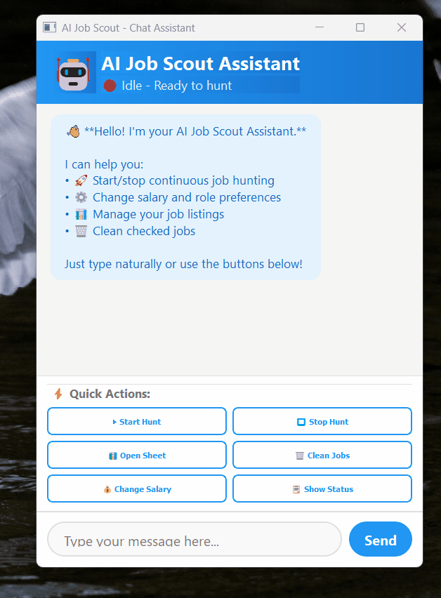
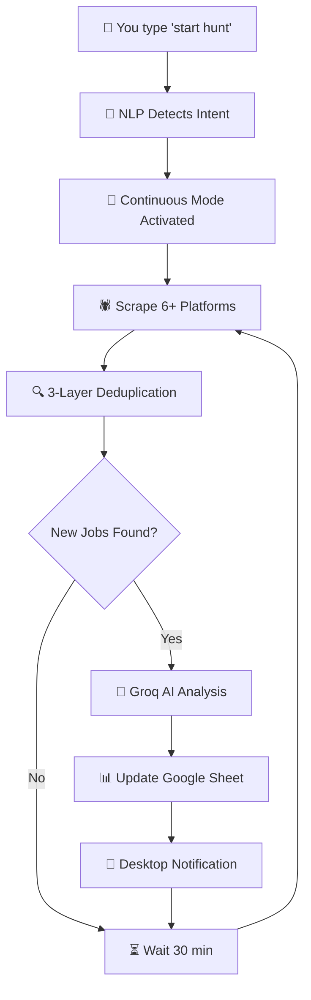
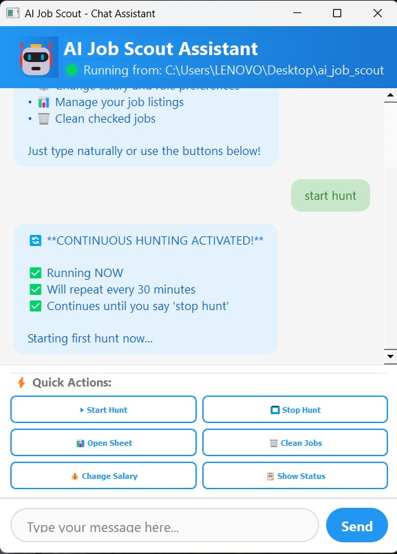

<div align="center">

<!-- ANIMATED HEADER BANNER -->


<!-- BADGES ROW 1 -->
<p>
  
  
  
  
</p>

<!-- BADGES ROW 2 -->
<p>
  
  
  
  
</p>

<!-- BADGES ROW 3 -->
<p>
  
  
  
  
</p>

<br/>

> ### *"While you sleep, your AI scout hunts. Wake up to opportunities."*

<br/>

</div>

---

<!-- DEMO GIF PLACEHOLDER -->
<div align="center">
  
</div>

---

## 🌟 What Is This?

**AI Job Scout** is a fully automated, AI-powered job hunting assistant that runs 24/7 on your desktop. It **scrapes 6+ job platforms**, **analyzes every listing with AI**, and **delivers curated opportunities directly to your Google Sheet** — all while you focus on preparing for interviews, not searching for them.

> Built from scratch in Python. No job board subscriptions. No manual searching. Just results.

---

## ⚡ Feature Showcase

<div align="center">

| 🔥 Feature | 💡 Description | 🚀 Tech Used |
|:----------:|:--------------|:------------:|
| **Multi-Platform Scraping** | Hunts across LinkedIn, Naukri, Glassdoor, Foundit, Indeed + 9 company career pages simultaneously | Selenium + BeautifulSoup |
| **AI Job Matching** | Scores every job against your profile using LLaMA 3.3 70B model | Groq API |
| **Chat Interface** | Natural language commands — just type like talking to a human | PyQt5 + Custom NLP |
| **Smart Deduplication** | 3-layer system ensures zero duplicate jobs ever reach your sheet | Custom Algorithm |
| **Auto-Hunt** | Runs every 30 minutes automatically, forever, until you say stop | APScheduler |
| **Google Sheets Sync** | Real-time updates to your personal job tracking spreadsheet | Google Sheets API |
| **Standalone .exe** | Share with anyone — no Python, no setup, just double-click | PyInstaller |
| **Docker Support** | Deploy on any server or cloud instance headlessly | Docker + Docker Compose |
| **System Tray** | Runs silently in background, notifies only when jobs found | PyQt5 SystemTray |
| **Run Tracker** | Remembers last hunt time — never fetches the same job twice | Custom Tracker |

</div>

---

## 🏗️ Architecture Deep Dive

```
┌─────────────────────────────────────────────────────────────────┐
│                    AI JOB SCOUT SYSTEM                          │
├─────────────────────────────────────────────────────────────────┤
│                                                                 │
│  ┌──────────────┐    NLP Commands    ┌──────────────────────┐   │
│  │   User Chat  │ ─────────────────► │   Bot Controller     │   │
│  │  Interface   │                    │  (Intent Routing)    │   │
│  │  (PyQt5 GUI) │ ◄───────────────── │  (APScheduler)       │   │
│  └──────────────┘    Bot Responses   └──────────┬───────────┘   │
│                                                 │               │
│                                    start_hunt() │               │
│                                                 ▼               │
│  ┌──────────────────────────────────────────────────────────┐   │
│  │              ORCHESTRATOR (main_subprocess.py)           │   │
│  ├──────────────┬──────────────┬──────────────┬────────────┤   │
│  │   TIER 1     │   TIER 2     │   TIER 3     │  TIER 4   │   │
│  │  LinkedIn    │   Naukri     │  Glassdoor   │ Company   │   │
│  │  Scraper     │   Scraper    │  Scraper     │ Scrapers  │   │
│  │              │              │              │ (9 sites) │   │
│  └──────┬───────┴──────┬───────┴──────┬───────┴─────┬──────┘   │
│         │              │              │             │           │
│         └──────────────┴──────────────┴─────────────┘           │
│                              │                                  │
│                              ▼                                  │
│              ┌───────────────────────────┐                      │
│              │   3-LAYER DEDUPLICATION   │                      │
│              │  Layer 1: Time Filter     │                      │
│              │  Layer 2: URL Check       │                      │
│              │  Layer 3: Similarity (95%)│                      │
│              └──────────────┬────────────┘                      │
│                             │                                   │
│                             ▼                                   │
│              ┌───────────────────────────┐                      │
│              │   GROQ AI ANALYSIS        │                      │
│              │   Model: LLaMA 3.3 70B    │                      │
│              │   • Match Score           │                      │
│              │   • Selection Chances     │                      │
│              │   • Salary Verification   │                      │
│              └──────────────┬────────────┘                      │
│                             │                                   │
│                             ▼                                   │
│              ┌───────────────────────────┐                      │
│              │   GOOGLE SHEETS UPDATE    │                      │
│              │   Auto-formats all data   │                      │
│              │   Checkbox for applied    │                      │
│              └───────────────────────────┘                      │
└─────────────────────────────────────────────────────────────────┘
```

---

## 🎯 How It Works



---

## 📸 Screenshots

<div align="center">
  
</div>

### 📊 Google Sheets Output
```
┌────┬──────────────────┬──────────────────┬──────────┬──────────┬────────────────────┐
│ ✅ │ Company          │ Job Title        │ Salary   │ Match %  │ AI Verdict         │
├────┼──────────────────┼──────────────────┼──────────┼──────────┼────────────────────┤
│ ☐  │ Google           │ Data Analyst     │ 28 LPA   │ 94%      │ 🔥 High Chance     │
│ ☐  │ Amazon           │ Business Analyst │ 32 LPA   │ 88%      │ ✅ Good Match      │
│ ☐  │ Flipkart         │ Data Scientist   │ 35 LPA   │ 76%      │ ✅ Good Match      │
│ ☑  │ Swiggy           │ ML Engineer      │ 40 LPA   │ 62%      │ 📊 Average Match   │
└────┴──────────────────┴──────────────────┴──────────┴──────────┴────────────────────┘
```

</div>

---

## 🚀 Quick Start

### Prerequisites

```bash
# Required
Python 3.11+
Google Chrome (latest)
Git

# API Keys needed (both FREE)
Groq API Key    → https://console.groq.com
Google Sheet ID → https://sheets.google.com
```

### Installation

```bash
# 1️⃣ Clone the repository
git clone https://github.com/chiragkalucha/AI_Job_Scout_Agent.git
cd ai-job-scout

# 2️⃣ Create virtual environment
python -m venv venv
venv\Scripts\activate          # Windows
source venv/bin/activate       # Linux/Mac

# 3️⃣ Install dependencies
pip install -r requirements.txt
pip install -r requirements_chatbot.txt

# 4️⃣ Configure settings
copy config\.env.example config\.env
notepad config\.env

# 5️⃣ Launch the chatbot!
python chatbot/main_app.py
```

### ⚙️ Configuration (config/.env)

```env
# ── REQUIRED ──────────────────────────────────────
GOOGLE_SHEET_ID=your_google_sheet_id_here
GROQ_API_KEY=your_groq_api_key_here

# ── JOB PREFERENCES ───────────────────────────────
MIN_SALARY_LPA=15                          # Minimum salary filter
MAX_EXPERIENCE_YEARS=2                     # 0-2 for fresher roles
JOB_ROLES=Data Analyst,Business Analyst    # Comma-separated roles

# ── AUTOMATION ────────────────────────────────────
HUNT_INTERVAL_MINUTES=30                   # How often to hunt
AUTO_DELETE_CHECKED=True                   # Clean applied jobs
```

---

## 💬 Chat Commands

<div align="center">

| Command | What It Does |
|:--------|:-------------|
| `start hunt` | 🚀 Activates continuous hunting every 30 min |
| `stop hunt` | ⏹️ Stops all hunting completely |
| `change salary to 25` | 💰 Updates minimum salary to 25 LPA |
| `change roles to X, Y` | 🎯 Replaces job roles entirely |
| `add Data Scientist` | ➕ Adds role to existing list |
| `remove Analyst` | ➖ Removes role from list |
| `clean jobs` | 🗑️ Removes checked/applied rows from sheet |
| `open sheet` | 📊 Opens Google Sheet in browser |
| `status` | 📋 Shows all current settings |
| `help` | ❓ Lists all available commands |

</div>

---

## 🕷️ Platforms Covered

<div align="center">

| Platform | Type | Method | Jobs/Run |
|:--------:|:----:|:------:|:--------:|
|  | Job Portal | Selenium | 10-20 |
|  | Job Portal | Selenium | 15-25 |
|  | Job Portal | Selenium | 8-15 |
|  | Job Portal | Selenium | 10-20 |
|  | Job Portal | RSS Feed | 5-15 |
|  | Company | API | 5-10 |
|  | Company | API | 5-10 |
|  | Company | HTML | 3-8 |
| **+ 6 more** | Company | Various | varies |

</div>

---

## 🧠 AI Analysis Engine

Every job gets scored by **LLaMA 3.3 70B** running on Groq's ultra-fast inference:

```
INPUT:  Job Title + Description + Requirements
        Your configured roles + salary expectations
        
OUTPUT: {
  "match_score": 94,
  "selection_chances": "High",
  "salary_verified": true,
  "estimated_salary": "28 LPA",
  "why_good_fit": "Strong alignment with data analysis requirements...",
  "concerns": "Requires 1 year experience - manageable for fresher"
}
```

**Inference Speed:** ~0.5 seconds per job analysis (Groq's GroqCloud)

---

## 🛡️ Smart Deduplication System

```
                    Raw Scraped Jobs (50-100 per run)
                              │
                              ▼
              ┌───────────────────────────────┐
              │  LAYER 1: TIME FILTER         │
              │  Only jobs posted AFTER       │
              │  last successful hunt         │
              │  Result: -40% jobs            │
              └──────────────┬────────────────┘
                             │
                             ▼
              ┌───────────────────────────────┐
              │  LAYER 2: URL DEDUPLICATION   │
              │  Check against all URLs       │
              │  already in Google Sheet      │
              │  Result: -30% more jobs       │
              └──────────────┬────────────────┘
                             │
                             ▼
              ┌───────────────────────────────┐
              │  LAYER 3: SIMILARITY CHECK    │
              │  Fuzzy match title+company    │
              │  95% threshold = duplicate    │
              │  Result: -10% more jobs       │
              └──────────────┬────────────────┘
                             │
                             ▼
                  ✅ 100% UNIQUE NEW JOBS
                  Ready for AI Analysis
```

---

## 🐳 Docker Deployment

```bash
# Clone & configure
git clone https://github.com/YOURUSERNAME/ai-job-scout.git
cd ai-job-scout
cp config/.env.example config/.env
nano config/.env                    # Add your API keys

# Launch headless scraper
docker-compose up -d

# Monitor live
docker-compose logs -f

# Stop
docker-compose down
```

```yaml
# docker-compose.yml highlights
services:
  job-scraper:
    build: .
    restart: unless-stopped          # Auto-restart on crash
    environment:
      HUNT_INTERVAL_MINUTES: 30      # Configurable interval
    volumes:
      - ./logs:/app/logs             # Persistent logs
      - ./config:/app/config         # Persistent config
    deploy:
      resources:
        limits:
          memory: 2G                 # Resource bounded
```

---

## 📦 Project Structure

```
ai_job_scout/
│
├── 🤖 chatbot/                    # Desktop GUI chatbot
│   ├── main_app.py                # ← Entry point
│   ├── bot_controller.py          # Command routing + scheduling
│   ├── chat_interface.py          # PyQt5 chat window
│   ├── system_tray.py             # System tray integration
│   ├── hunt_manager.py            # Subprocess management
│   ├── nlp_processor.py           # Intent detection (no heavy NLP libs!)
│   └── config_manager.py          # .env read/write
│
├── 🕷️ scrapers/                   # Job scrapers
│   ├── linkedin_scraper.py        # LinkedIn (Selenium)
│   ├── naukri_scraper.py          # Naukri (Selenium)
│   ├── glassdoor_scraper.py       # Glassdoor (Selenium)
│   ├── foundit_scraper.py         # Foundit (Selenium)
│   ├── indeed_scraper.py          # Indeed (RSS)
│   └── company_scrapers.py        # 9 company career pages
│
├── 🧠 ai_analysis/                # AI scoring engine
│   └── resume_analyzer.py         # Groq + LLaMA 3.3 70B
│
├── 📊 sheets_integration/         # Google Sheets
│   └── sheets_updater.py          # CRUD operations
│
├── 🔧 utils/                      # Utilities
│   ├── run_tracker.py             # Last-run timestamp logic
│   ├── job_deduplicator.py        # 3-layer dedup system
│   ├── job_filter.py              # Experience + salary filter
│   ├── salary_extractor.py        # Regex salary parsing
│   └── silent_browser.py          # Headless Chrome factory
│
├── ⚙️ config/
│   ├── .env                       # Your config (gitignored)
│   └── .env.example               # Template for new users
│
├── 🐳 Dockerfile                  # Docker build config
├── 🐳 docker-compose.yml          # Docker orchestration
├── 🐍 main.py                     # Manual single run
├── 🐍 main_subprocess.py          # Chatbot-invoked run (UTF-8 safe)
├── 🐍 docker_runner.py            # Docker scheduler
└── 🐍 orchestrator.py             # Scraper coordinator
```

---

## 📈 Performance Metrics

<div align="center">

| Metric | Value |
|:-------|:-----:|
| ⏱️ Average hunt duration | 8-12 minutes |
| 📊 Jobs per hunt (typical) | 15-40 new jobs |
| 🎯 Deduplication accuracy | ~99% |
| 🤖 AI analysis speed | ~0.5s per job |
| 🔄 Auto-hunt interval | Every 30 min |
| 💾 Memory usage | ~200MB (with Chrome) |
| 🐳 Docker memory limit | 2GB |
| ⚡ First run time | ~10 minutes |

</div>

---

## 🛠️ Tech Stack

<div align="center">

**Core**


**AI & APIs**


**Desktop App**


**Deployment**


</div>

---

## 🗺️ Roadmap

- [x] Multi-platform scraping (6 platforms)
- [x] AI job analysis with Groq/LLaMA
- [x] Google Sheets integration
- [x] PyQt5 desktop chatbot
- [x] Natural language commands
- [x] Continuous auto-hunting
- [x] 3-layer deduplication
- [x] Standalone .exe build
- [x] Docker support
- [ ] 🔜 Email/WhatsApp notifications
- [ ] 🔜 Resume auto-tailoring per job
- [ ] 🔜 Web dashboard (React)
- [ ] 🔜 Auto job application (Easy Apply)
- [ ] 🔜 Interview scheduler integration
- [ ] 🔜 Salary negotiation insights

---

## 🤝 Contributing

```bash
# 1. Fork the repository
# 2. Create your feature branch
git checkout -b feature/auto-apply

# 3. Commit your changes
git commit -m "Add LinkedIn Easy Apply automation"

# 4. Push to branch
git push origin feature/auto-apply

# 5. Open a Pull Request
```

---

## ⚠️ Disclaimer

> This tool is intended for **personal use only**. Always respect the Terms of Service of job platforms. Use responsibly and ethically. The authors are not responsible for any misuse or violations of third-party terms of service.

---

## 📄 License

```
Copyright 2026 AI Job Scout

Licensed under the Apache License, Version 2.0
You may not use this file except in compliance with the License.

See LICENSE file for full details.
```

---

<div align="center">

<!-- FOOTER WAVE -->


**Built with 🤖 + ☕ + 💪 to automate the job hunt grind**

*If this project helped you land a job — give it a ⭐ and pay it forward!*

[](https://github.com/YOURUSERNAME/ai-job-scout)
[](https://github.com/YOURUSERNAME/ai-job-scout)
[](https://github.com/YOURUSERNAME/ai-job-scout)

</div>